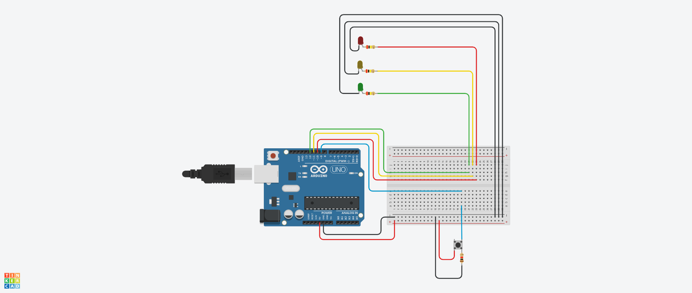

# Curso de Extensão sobre Arduino
Programas para arduino desenvolvidos ao longo do curso de extensão Arduino Básico - Unisociesc/2022.

#### Alarme
Programinha com sensor que toca o buzzer quando detecta movimentos.

#### LDR
Programinha que aciona os leds conforme a luminosidade do ambiente.

#### Sinaleiro
Programinha que simula um sinaleiro de trânsito.

